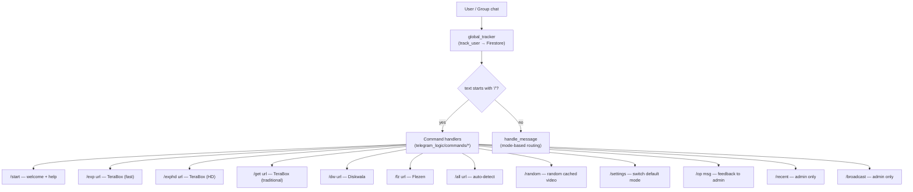
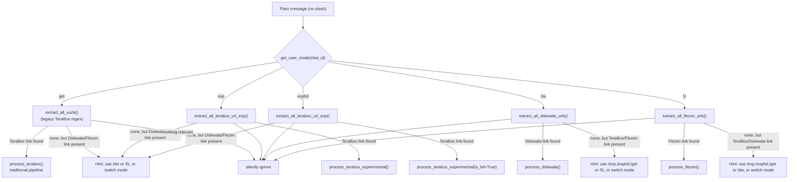
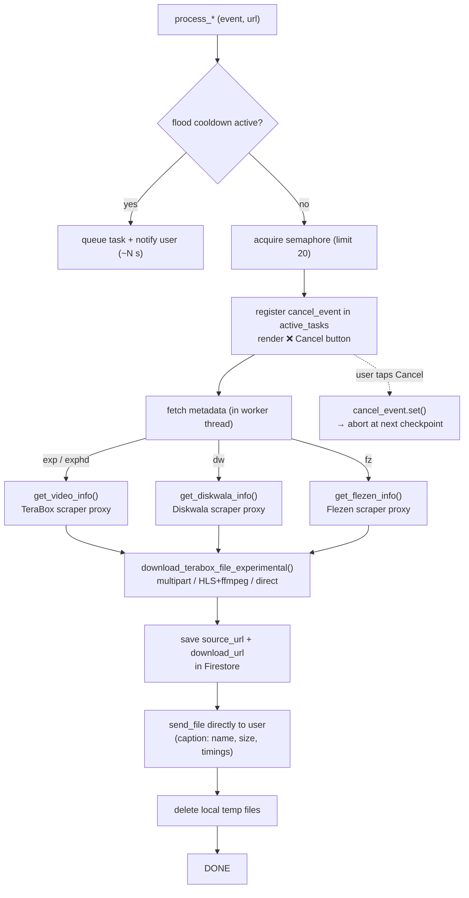

# TeraBox / Diskwala / Flezen Video Downloader

Downloads full-length videos from **TeraBox** (and its mirror domains), **Diskwala**, and **Flezen**, then delivers them directly through Telegram. Resolved source/download URLs are catalogued in Firebase for `/random`; Telegram storage-group message caching is no longer used.

---

## Features

- **Auto-detect links**: Paste a TeraBox, Diskwala, or Flezen URL anywhere in a message; it auto-downloads according to your selected mode.
- **Four download engines / five modes**:
  - **Traditional (`/get`)** — Budget-capped TS chunk collector relying on rotating cookies. *[Unstable — best for small files]*
  - **Experimental (`/exp`, `/exphd`)** — Fast extractor via a scraper proxy that resolves direct CDN links; `/exphd` targets HD. *[Recommended]*
  - **Diskwala (`/dw`)** — Resolves Diskwala share links via a scraper proxy and downloads the direct video. *[New]*
  - **Flezen (`/fz`)** — Resolves Flezen share links via a scraper proxy and downloads the direct video. *[New]*
- **`all` mode / `/all`**: Auto-detects TeraBox, Diskwala, or Flezen links — as a default mode (via `/settings`) or one-off via `/all <link>`. TeraBox links are routed through a separately persisted **TeraBox engine** preference (`get`/`exp`/`exphd`, default `exp`), switchable from `/settings` independently of the overall mode.
- **Expanded TeraBox domain support** (`/exp`, `/exphd`): `terabox.com`, `1024terabox.com`, `teraboxapp.com`, `freeterabox.com`, `terabox.app`, `terabox.fun`, `4funbox.co/.com`, `mirrobox.com`, `nephobox.com`, `1024tera.com`, `momerybox.com`, `tibibox.com` (with optional `www.`), in both `{base}/<something>/{SURL}` and `{base}/{SURL}` URL shapes.
- **Smart mode hints**: Sending a Diskwala link while in a TeraBox mode (or a TeraBox link while in `dw` mode) replies with the correct command / mode to switch to, instead of silently ignoring it.
- **`/random`**: Selects a cached download URL, downloads it, and uploads it to the requesting user with live progress and transfer timings.
- **`/settings`**: Switch the default auto-download mode (`get`, `exp`, `exphd`, `dw`, `fz`, `all`) and, independently, the TeraBox engine used by `all` mode.
- **`/op <msg>`**: Send feedback to the admin.
- **Admin Commands**:
  - **`/recent`**: Show recent users interacting with the bot.
  - **`/broadcast`**: Broadcast a message to all known users and groups.
- **Cancel button**: Inline button to abort an in-progress download at the next checkpoint.
- **Video thumbnails**: Uses provider thumbnails when available and a random FFmpeg frame as fallback, with at most five preview jobs running concurrently.
- **URL catalogue**: Firestore stores `source_url` and `download_url`; Telegram message IDs and storage-group media are not used.
- **Persistent DB via Firebase Firestore**: Tracks users, chat IDs, and each user's selected mode.
- **Flood Control Queue**: Custom semaphore and async queue handling to survive `FloodWaitError` during viral moments.
- **Quality fallback**: Tries 1080p -> 720p -> 480p -> 360p automatically (on the traditional pipeline).

---

## Architecture

### 1. Command structure

Every incoming update first passes through `global_tracker` (records the user in Firestore), then splits on whether the text is a slash command or a plain message.



### 2. Plain-message routing (conditional logic)

For a message with no command, the bot looks up the user's mode and picks the matching URL matcher. If the expected link type is absent but the *other* type is present, it replies with a hint instead of ignoring the message.



> The same cross-type hint logic is repeated inside the explicit command handlers — e.g. `/dw <terabox-link>` points you at `/exp`, and `/exp <diskwala-link>` points you at `/dw`.

### 3. Low-level download pipeline

`/exp`, `/exphd`, `/dw`, and `/fz` share one pipeline (in `terabox_exp.py` / `diskwala.py` / `flezen.py`), differing only in the **metadata source**. `/get` follows an analogous path with the traditional chunk collector. All Telegram sends flow through the flood-aware queue, and every phase honours the inline **Cancel** button via a `threading.Event`.



---

## Firebase Media Cache Schema

### Firebase free-tier limitations

The cache design must account for operation quotas as well as storage:

| Resource | Free allowance |
|---|---:|
| Stored data | 1 GiB |
| Document reads | 50,000 per day |
| Document writes | 20,000 per day |
| Document deletes | 20,000 per day |
| Maximum size of one document | 1 MiB (hard limit on every plan) |

Daily quotas reset around midnight Pacific Time. When a quota is exhausted, Firebase-backed features such as `/random`, persistent `/settings`, user tracking, `/recent`, and `/broadcast` user lookup can temporarily fail. Explicit `/get`, `/exp`, `/exphd`, and `/dw` downloads remain operational because database failures are handled as non-fatal.

### Logical media record

The catalogue never stores Telegram message IDs. Each logical record contains:

```json
{
  "hash_id": "h_<sha256(source_url)>",
  "source_url": "https://source.example/item",
  "download_url": "https://cdn.example/video.mp4"
}
```

`hash_id` is internal and is never displayed to users. Modes must remain distinguishable because `/exp` and `/exphd` can resolve the same source to different download URLs.

### Previous schema: one large document per mode

```text
cache/get
cache/exp
cache/exphd
cache/dw
cache/fz
```

Each mode document held a map of `hash_id -> {source_url, download_url}`.

**Benefits**

- Very few billed writes for bulk imports.
- One billed document read could load an entire mode.
- Straightforward implementation.

**Demerits**

- The 1 MiB hard limit makes the full catalogue impossible to store. The 41,459 eligible Diskwala records alone serialize to approximately 10.87 MiB.
- Every insertion updates the same hot document, causing write contention.
- Looking up one item transfers the entire mode document.
- Individual records are difficult to query, update, or delete.

### Alternative schema: one document per media item

```text
cache/dw_h_<sha256>
cache/exp_h_<sha256>
cache/exphd_h_<sha256>
cache/get_h_<sha256>
cache/fz_h_<sha256>
```

Each document contains `hash_id`, `mode`, `source_url`, `download_url`, and a stable `random_key` for `/random`.

**Benefits**

- No aggregate 1 MiB limit.
- One small direct read per source lookup.
- Independent concurrent writes without a hot document.
- Efficient individual updates and deletes.
- `/random` normally needs only one or two indexed reads.
- Scales technically to very large catalogues.

**Demerits**

- Initial import requires one write per item. Importing 41,459 Diskwala records exceeds the 20,000 daily write allowance.
- A full scan costs one read per record and nearly exhausts the 50,000 daily read allowance.
- Bulk cleanup requires one delete per item.
- Every document adds metadata and index-storage overhead.
- Random range selection is efficient but only approximately uniform.

### **Recommended approach: 256 sharded documents in `cache`**

> **RECOMMENDED:** Use 256 deterministic shards per mode inside the existing `cache` collection. This is the best balance for Firestore's free tier.

```text
cache/dw_000       ... cache/dw_0ff
cache/exp_000      ... cache/exp_0ff
cache/exphd_000    ... cache/exphd_0ff
cache/get_000      ... cache/get_0ff
cache/fz_000       ... cache/fz_0ff
```

Each shard stores a bounded map:

```json
{
  "h_abc123...": {
    "source_url": "https://www.diskwala.com/app/abc123",
    "download_url": "https://cdn.example/video.mp4"
  }
}
```

The shard is deterministic:

```python
shard_number = int(hash_id[2:10], 16) % 256
```

**Benefits**

- Keeps documents safely below 1 MiB for substantially more growth.
- Importing 41,459 records requires at most 256 writes instead of 41,459.
- A direct lookup reads exactly one known shard.
- `/random` can read one shard and choose an entry in memory.
- No additional top-level collection is required.
- `get`, `exp`, `exphd`, `dw`, and `fz` use the same structure.
- **Adding a new mode is additive, not a migration**: since every mode already lives in the same sharded `cache` collection, appending a new mode is just registering it in the `MODES` tuple. Its shard documents (e.g. `cache/fz_000`) are created lazily by the first write — no existing shard is read, rewritten, or deleted.
- Write contention is distributed across 256 documents.
- A complete four-mode maintenance scan requires at most 1,024 reads rather than one read per media item.

**Demerits**

- One shard read transfers multiple entries instead of one item.
- Individual deletion requires a nested-field update.
- Random shard selection can slightly favor entries in smaller shards; weighted shard selection removes this bias.
- Extreme future growth can eventually push shards toward 1 MiB and require more shards.
- Concurrent writes can still contend when they target the same shard, though 256-way distribution makes this unlikely.

### Comparison

| Property | One mode document | One media document | **256 shards (recommended)** |
|---|---:|---:|---:|
| Writes for 41,459-record import | Impossible payload | 41,459 | Up to 256 |
| Direct lookup | 1 huge read | 1 small read | 1 medium read |
| Typical `/random` reads | 1–4 | 1–2 | 1 |
| Safe from 1 MiB limit | No | Yes | Yes |
| Free-tier friendly | No | Poor for migration | **Yes** |
| Concurrent writes | Poor | Excellent | Good |
| Individual management | Poor | Excellent | Moderate |
| Full catalogue scan | Few reads, impossible size | Tens of thousands | Hundreds |

### Shared limitation: expiring download URLs

All schemas store CDN URLs that may expire. `/random` must handle failed downloads gracefully, and stale records should eventually be refreshed from `source_url` or removed.

### Telegram video thumbnails

Every upload pipeline (`/get`, `/exp`, `/exphd`, `/dw`, `/fz`, and `/random`) prepares a Telegram-compatible JPEG preview:

- TeraBox uses `list[0].thumbs.url1` (then `url2`/`icon`) when provided by the proxy.
- Diskwala uses `fileInfo.thumb` when provided by the proxy.
- Flezen's proxy response carries no thumbnail field, so previews always fall back to a local FFmpeg frame.
- Provider images are resized to at most 320×320 and recompressed below 20 KB.
- Missing or invalid provider images fall back to a random frame between 10% and 90% of the completed local video.
- The `.jpg` is passed through Telethon's `thumb=` argument with explicit `DocumentAttributeVideo` duration and dimensions.
- A dedicated `asyncio.Semaphore(5)` limits FFmpeg/ffprobe work to five concurrent jobs. Additional previews wait in a rolling queue while download/upload concurrency remains separately bounded.
- Preview failures are non-fatal: the video is uploaded without a custom thumbnail.
- Every preview uses an isolated temporary directory and is deleted after the Telegram upload completes.

### Runtime memory and JSON cache

The bot does not query Firestore for every command. It maintains a complete runtime cache in memory and persists an atomic local snapshot to `runtime_cache.json`.

Startup behavior:

1. Load `runtime_cache.json` when available.
2. Read the small Firestore `_meta` document.
3. Batch-fetch only shards whose versions changed since the JSON snapshot.
4. On the first startup without a snapshot, batch-read all non-empty shards once.
5. Persist the refreshed snapshot using a temporary file followed by an atomic rename.

Telegram connects before this work begins. Initial Firestore loading runs in a daemon background thread in batches of 20 shards with bounded request timeouts. Every completed batch is merged into the live cache immediately, so `/random` becomes usable after the first batch rather than waiting for all shards. `/random` waits briefly when invoked before that first batch arrives.

`/exp`, `/exphd`, and `/dw` remain usable throughout loading. They use already-loaded shards when available and otherwise resolve through their provider normally. Cache writes update live memory immediately and are merged safely with incoming startup batches; a startup read cannot overwrite a newer command write. Ctrl+C does not wait for the background Firebase thread, and shutdown performs no Firebase network operation.

Set `CACHE_SNAPSHOT_PATH` to a persistent mounted path when the bot runs in an ephemeral container. Otherwise, each new deployment may require another complete initial shard read.

```env
CACHE_SNAPSHOT_PATH=/persistent-data/runtime_cache.json
```

The in-memory cache is intentionally complete rather than an LRU cache. The current catalogue is small enough to fit comfortably in memory, and retaining every record makes `/random` and source lookups constant-time without database access.

#### Runtime operation costs

| Operation | Firestore reads | Firestore writes |
|---|---:|---:|
| `/random` | 0 | 0 |
| Cached `/exp`, `/exphd`, or `/dw` | 0 | 0 |
| New or refreshed URL | 0 | 1 shard write |
| Five-minute synchronization | 1 metadata read | Up to 1 batched metadata write when local shards changed |
| Changed shard from another worker | 1 read per changed shard | 0 |
| First startup without JSON | Approximately one read per non-empty shard plus `_meta` | 0 |
| Later startup with JSON | 1 metadata read plus changed shards | 0 |

At a five-minute interval, an idle bot performs only **288 small metadata reads per day**, well below the 50,000-read free-tier allowance. Metadata version updates for multiple media additions are combined into one write per interval instead of one metadata write per item.

#### Command behavior

- `/random` selects directly from memory and performs no Firebase or provider-proxy lookup.
- `/exp`, `/exphd`, `/dw`, and `/fz` check memory before calling their provider proxy.
- A valid cache hit downloads immediately and does not write to Firestore again.
- If a cached signed URL has expired, the command calls its provider proxy once, retries the download, and refreshes Firestore and memory.
- New cache entries update local memory immediately; other bot workers receive them through the versioned five-minute refresh.
- Cached records can include `filename` and `file_size`, avoiding filename probes and allowing `/random` to display the actual media name.

---

## Incident Log: 2026-08-25 (Firestore `%28default%29` on VPS)

### Symptom

- Local run succeeded.
- ARM VPS deployment failed with repeated Firestore errors:
  - `400 Invalid database id %28default%29`
  - Startup cache load fell back to JSON snapshot.

### Investigation summary

- Effective Firestore-related env vars for database override were empty on both local and VPS:
  - `FIRESTORE_DATABASE_ID`
  - `GOOGLE_CLOUD_FIRESTORE_DATABASE_ID`
  - `FIRESTORE_DATABASE`
  - `GOOGLE_FIRESTORE_DATABASE`
- Both environments resolved `database_id=None` in app code.
- But runtime client internals differed:
  - Local database path: `projects/<project>/databases/(default)`
  - VPS database path: `projects/<project>/databases/%28default%29`
- This proved the failure was not from explicit override env vars, but from runtime dependency behavior in the deployed environment.

### Resolution applied

- Pinned Firebase libraries in `requirements.txt`:
  - `firebase-admin==6.6.0`
  - `google-cloud-firestore==2.19.0`
- Kept defensive Firestore database-id normalization in `firebase_db/db.py`.
- Redeployed container with fresh dependency install.

### Prevention

- Keep Firebase/Firestore dependencies pinned across local and production.
- Avoid unpinned cloud SDK dependencies in production images.
- During deploy verification, log and check the resolved Firestore database path at startup.

#### Synchronization and collision safety

Each shard has a version recorded in `cache/_meta`. Local shard-version changes are accumulated and published in one metadata write during the refresh interval. Refreshes compare versions and batch-read only newer shards.

To handle races during the five-minute synchronization gap:

- Local writes update memory before waiting for the next refresh.
- A refresh never replaces a shard when a newer local version appeared after metadata polling.
- Repeated writes for the same source update the existing cache entry rather than creating duplicates.
- If two different source URLs ever produce the same SHA-256 key, deterministic collision suffixes allocate separate keys instead of overwriting either record.
- The JSON snapshot is ignored by Git through `.gitignore` because it contains runtime CDN URLs.

### Migration safety

- Do not delete an old schema until all target records are written and verified.
- Migration scripts must be resumable and idempotent.
- Reads, writes, and deletes have separate daily quotas.
- Large per-media migrations require multiple reset windows or temporary Blaze billing.
- Prefer the recommended sharded schema to keep bulk migration and maintenance within free-tier quotas.

---

## Project Structure

```text
main.py                        # Entry point, FastAPI wrapper, global tracker, mode routing, command registration
.env                           # Secrets (not committed)
Dockerfile / docker-compose.yml  # Container configuration
requirements.txt               # Python package dependencies
apt.txt                        # OS-level dependencies (ffmpeg, etc.)

telegram_logic/
  bot.py                       # Telethon client + flood-safe send/cancel helpers
  helpers.py                   # URL matchers (TeraBox legacy + experimental, Diskwala), size/duration formatting
  progress_callbacks.py        # Live progress-message editing during download & upload
  queue.py                     # Semaphore + flood-wait queue
  terabox_trad.py              # Traditional (/get) pipeline
  terabox_exp.py               # Experimental (/exp, /exphd) pipeline
  diskwala.py                  # Diskwala (/dw) pipeline
  flezen.py                    # Flezen (/fz) pipeline
  auto_route.py                # Shared link auto-detect + dispatch (used by "all" mode and /all)
  commands/                    # Individual Telegram command handlers
    start.py                   # /start
    get.py                     # /get <url>
    experimental.py            # /exp and /exphd <url>
    diskwala.py                # /dw <url>
    flezen.py                  # /fz <url>
    all_mode.py                # /all <url> — auto-detect
    random.py                  # /random
    settings.py                # /settings (download-mode switch)
    opinion.py                 # /op <msg> (feedback to admin)
    cancel_download.py         # Inline "Cancel" callback handler
    recent.py                  # /recent (Admin)
    broadcast.py               # /broadcast (Admin)

terabox/                       # Traditional (/get) API approach
  public_api.py                # Public interface for traditional pipeline
  core_pipeline.py             # Internal extraction, chunk discovery, ts download
  internal_helpers.py          # Shared utilities and custom exceptions

teraboxDL/                     # Experimental (/exp, /exphd) extractor
  terabox_dl.py                # Metadata via scraper proxy (get_video_info)
  public_api.py                # download_terabox_file_experimental (concurrent multipart downloader)
  stream_downloader.py         # HLS / direct stream downloader + ffmpeg remux

diskwalaDL/                    # Diskwala (/dw) extractor
  public_api.py                # Diskwala proxy client + URL helpers (get_diskwala_info)

flezen/                        # Flezen (/fz) extractor
  public_api.py                # Flezen proxy client + URL helpers (get_flezen_info)

firebase_db/                   # Firebase Firestore persistence
  db.py                        # Firestore client initialisation
  users.py                     # User tracking + per-user mode (get/exp/exphd/dw/fz/all) + terabox_mode (used by "all")
  cache.py                     # Firestore source/download URL catalogue (get/exp/exphd/dw/fz)
```

---

## Setup

### 1. Prerequisites

- Python 3.11+
- `ffmpeg` available on `PATH` (used to remux HLS `.ts` segments into `.mp4`)
- A Firebase project with Firestore enabled (service-account credentials)
- Access to the TeraBox, Diskwala, and Flezen scraper proxies (URLs + API keys)

### 2. Install dependencies

```bash
pip install -r requirements.txt
```

### 3. Configure environment

Create a `.env` file in the project root:

```env
BOT_TOKEN=your_telegram_bot_token
APP_ID=your_telegram_app_id
API_HASH=your_telegram_api_hash
ADMIN_ID=12345678                       # your user ID to access /broadcast and /recent

# Firebase Firestore (service-account JSON as a single-line string)
FIREBASE_SECRETS={"type":"service_account", ... }

# Experimental (/exp, /exphd) scraper proxy
THIRD_PARTY_TERABOXDL_URL=https://www.teraboxdl.site/
PROXY_URL=http://<proxy-host>/v1

# Diskwala (/dw) scraper proxy
DISKWALA_PROXY_URL=http://<proxy-host>/video
DISKWALA_API_KEY=your_diskwala_api_key  # sent as the x-api-key request header

# Flezen (/fz) scraper proxy
FLEZEN_PROXY_URL=http://<proxy-host>/flezen/video
FLEZEN_API_KEY=your_flezen_api_key      # sent as the x-api-key request header

# Traditional (/get) cookies (browser Cookie header string)
COOKIES1=browserid=...; TSID=...
COOKIES2=...
```

- `BOT_TOKEN` — from [@BotFather](https://t.me/BotFather)
- `APP_ID` / `API_HASH` — from [my.telegram.org](https://my.telegram.org)
- `FIREBASE_SECRETS` — the Firestore service-account JSON, collapsed to one line; persists users, modes, and the video cache.
- `THIRD_PARTY_TERABOXDL_URL` / `PROXY_URL` — endpoints the experimental (`/exp`, `/exphd`) pipeline uses to resolve TeraBox links.
- `DISKWALA_PROXY_URL` / `DISKWALA_API_KEY` — the Diskwala (`/dw`) proxy endpoint and its `x-api-key`.
- `FLEZEN_PROXY_URL` / `FLEZEN_API_KEY` — the Flezen (`/fz`) proxy endpoint and its `x-api-key`.
- `COOKIES1..N` — TeraBox session cookies for the traditional (`/get`) pipeline.

### 4. Add cookies (For Traditional Mode)

The bot authenticates with TeraBox using browser cookies. Save your copied cookie header directly inside `.env` under `COOKIES1` and `COOKIES2`. Or you can save them in `cookies.txt` in Netscape format.

See [Extracting Cookies](#extracting-cookies) below.

### 5. Run

Locally:
```bash
python main.py
```

Using Docker:
```bash
docker build -t terabox-bot .
docker run -d --env-file .env terabox-bot
```

---

## Limitations

1. **Telegram File Size Limit**: Telegram restricts standard bot file uploads to **50 MB** and strictly restricts using local API servers to **2 GB**. Any resulting video chunk transcoded to more than maximum limits will fail.
2. **Rate Limits & API Bans**: TeraBox API rate-limits aggressively on the traditional (`/get`) approach. We use budget limits to avoid IP bans but this may leave >1 hour videos missing a sub-segment (skip ~4 minutes).
3. **Concurrency & throughput**: The experimental (`/exp`, `/exphd`) and Diskwala (`/dw`) pipelines resolve links through external scraper proxies and download via concurrent multipart connections. A global semaphore (limit 20) plus the flood-wait queue bound how many downloads/uploads run at once; downloads are still disk- and bandwidth-bound on a low-end VPS.
4. **Proxy / link expiry**: The scraper proxies and the direct CDN links they return are time-limited. Resolution can break when TeraBox or Diskwala change their backends, necessitating proxy-side tweaks.

---

## Extracting Cookies (For Traditional pipeline)

The TeraBox traditional download pipeline requires authenticated session cookies. To extract them:

1. Open any TeraBox share link in a **desktop browser** and log in.
2. Open the same link again so the video preview loads.
3. Open **DevTools -> Network** tab while the page loads.
4. Find the top-level request to `surl?...` that returns **200 OK** (not a redirect).
5. Copy all cookies from its **Request Headers -> Cookie** field into your `.env` (as `COOKIES1`=...).

---

## Key Concepts

### What Are Chunks / Segments?

TeraBox does **not** give you a single download link for large videos. Instead, the video is internally split into **N sequential chunks** (also called "TS segments"), each roughly covering a **~4-minute window** of the video.

Each chunk is a `.ts` (MPEG Transport Stream) file named with an index suffix like `_0_ts`, `_1_ts`, `_2_ts` … `_N_ts`.  To reconstruct the full video, you must download **every** chunk in order and remux them into a single `.mp4`.

### Which Endpoints Do We Hit?

| # | Endpoint / URL | Purpose | Returns |
|---|----------------|---------|---------|
| 1 | `GET /wap/share/filelist?surl=…` | Load the share page HTML | HTML containing `jsToken` (anti-CSRF) |
| 2 | `GET /api/shorturlinfo?shorturl=…&jsToken=…` | Fetch file metadata | JSON with `shareid`, `uk`, `sign`, `timestamp`, `fs_id`, file names, sizes |
| 3 | `GET /share/streaming?…&type=M3U8_AUTO_1080&start=0` | Request HLS playlist | M3U8 text — returns **one random chunk** (see below) |
| 4 | `GET <cdn_url>/chunk_N.ts?range=0-…&len=…` | Download a single TS chunk | Raw binary `.ts` data |

> **Important:** Each chunk URL contains a **unique cryptographic signature** in its path.  You cannot fabricate or guess URLs — every chunk URL must come from an actual API response.

---

## Current Approach: Budget-Capped Collector

The current algorithm treats the problem pragmatically: **collect as many chunks as possible within a request budget, accept occasional gaps**.

### How It Works

1. **Blind poll** the streaming endpoint repeatedly (the `start` param is ignored, so we just send `start=0`)
2. **Track** discovered chunks by their unique `_N_ts` index in the URL path
3. **Stop** when either condition fires:

| Rule | Condition | Purpose |
|------|-----------|---------|
| **Early stop** | `is_complete()` AND `no_new_max_streak >= max(10, max_idx)` | Confident we have everything |
| **Budget cap** | `req_count >= max(30, max_idx × 3)`, hard capped at **100** | Prevent rate-limiting |

### `is_complete()` Logic

Returns `True` only when:
- `min(known) ≤ 1` — chunks start at index 0 or 1
- All indices between min and max are present (no gaps)

### API Request Estimates

| Video Length | Est. Chunks | Budget Cap | Expected Found | Expected Missing |
|:-------------|:-----------|:-----------|:--------------|:----------------|
| **10 min**   | 3          | 30         | 3 (all)       | 0               |
| **30 min**   | 8          | 30         | ~8            | ~0              |
| **40 min**   | 10         | 30         | ~9-10         | 0-1             |
| **1 hour**   | 15         | 45         | ~14           | ~1              |
| **2 hours**  | 30         | 90 → 100 (cap) | ~29      | ~1              |

> [!WARNING]
> **Tradeoff:** This approach may miss 1-2 chunks on unlucky runs for longer videos. A missing chunk means ~4 minutes of video is lost. This is an acceptable tradeoff vs. getting shadow-banned by the API.

---

## Edge Cases & How They're Handled

| Edge Case | How It's Handled |
|-----------|------------------|
| **Very short video (1-2 chunks)** | Min budget of 30 requests. More than enough to find 1-2 chunks and confirm no others exist. |
| **Network error during M3U8 query** | `query_random_chunk` catches `RequestException`, sleeps 2s, returns empty (loop continues). |
| **Network error on TS chunk download** | `_download_segment` retries up to **3 times** with 2s delays. |
| **Non-M3U8 response (throttled/banned)** | Sleeps 0.5s and returns empty (loop continues, budget still ticks down). |
| **All quality levels fail** | `QUALITIES` cascades: `1080 → 720 → 480 → 360`. Each failure triggers cleanup. |
| **Gaps remain after budget** | Missing indices are printed as warnings (⚠). Video is assembled from available chunks. |

---


Here is exactly how a scenario plays out when Telegram hits you with a `FloodWaitError` and the custom message queue kicks in:

### The Scenario: A Viral Moment
Suppose your bot goes viral in a large group, and 50 users all send a TeraBox link at the exact same minute. 

1. **Working Normally (Semaphore):** 
   - The bot receives 50 links almost simultaneously.
   - The Semaphore (`asyncio.Semaphore(20)`) immediately grabs the first 20 links and starts resolving/downloading them. The other 30 wait in memory.
   - The 20 active pipelines fetch metadata and update their `status.edit(...)` progress texts (`0%`, `10%`, etc.).

2. **The Breaking Point (`FloodWaitError` happens):**
   - Because 20 active jobs are constantly editing their status messages ("Uploading 10%", "Uploading 20%"), Telegram says: *"Whoa, you are sending too many API requests per second!"*
   - Telegram blocks the bot's API access entirely and throws a `FloodWaitError` telling it to wait **400 seconds**.

3. **The Custom Queue Kicks In (Mid-Processing):**
   - One of the active downloads [_safe_send(status.edit, "50%...")] hits the error. 
   - [_safe_send()] catches the error, sets the global cooldown (`_flood_until = now + 400s`), and goes to sleep for 400 seconds.
   - Any other active downloads trying to edit their text will also hit the error, update the cooldown, and sleep in place. **(Downloads don't cancel, they just pause their Telegram progress updates!)**

4. **New Users Arrive (The Queue at Work):**
   - With 150 seconds still left on the cooldown block, another user (User #51) pastes a new TeraBox link.
   - Instead of trying to process it, [_process_terabox()] checks [_flood_remaining()] and sees `150s` left.
   - The bot immediately shoves User #51's link into the `_flood_queue` and manages to send *one* last message (rate limits sometimes allow single critical replies):
     > *"⏳ Bot overloaded! Your request for [link] has been queued and will be processed automatically in ~150s."*

5. **The Cooldown Expires:**
   - 400 seconds finally pass. Telegram unblocks the bot.
   - The original 20 active downloads wake up from their sleep inside [_safe_send()], successfully update their status (`status.edit("80%...")`), and finish normally, sending the videos.
   
6. **The Background Worker Drains the Queue:**
   - The background task [_queue_worker()] wakes up and checks the `_flood_queue`.
   - It sees User #51's link sitting there.
   - It pulls it out, waits another 2 seconds (just to be gentle on Telegram's API so we don't instantly get blocked again), and then pushes it through the normal pipeline (`Fetching metadata... → Downloading... → Delivery`).
   - The user gets their video automatically without having had to type `/retry` or paste the URL a second time.
---
