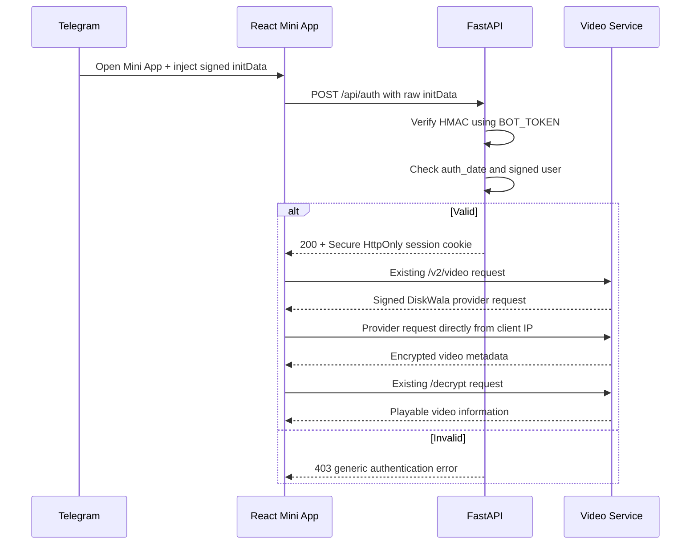

# TELEGRAM MINI APP INIT DATA AUTHENTICATION PLAN

Goal
----
Only allow a Mini App session to use protected backend APIs after the existing
FastAPI service proves that the request was launched by Telegram and that its
signed initData is recent and untampered.

Important repository finding
----------------------------
https://github.com/tg-ats/telegram-init-data is a small, unreleased TypeScript
reference implementation. It is not a Python/FastAPI package and is not
published on npm or PyPI. Use its algorithm and Telegram's official validation
documentation as references, but implement and test the validator in Python.

Target request flow
-------------------
1. Telegram opens the Mini App over HTTPS.
2. Telegram injects window.Telegram.WebApp.initData into the WebView.
3. React reads the raw initData string. It never sends BOT_TOKEN or trusts
   initDataUnsafe as identity.
4. React POSTs the raw string once to same-origin POST /api/auth.
5. FastAPI validates the signature with the server-only BOT_TOKEN, validates
   auth_date freshness, and parses the signed Telegram user.
6. Invalid, missing, expired, malformed, or tampered data receives a generic
   HTTP 403. No validation details or raw initData are logged.
7. Valid data creates a short-lived application session in a Secure, HttpOnly,
   SameSite cookie signed with a separate WEBAPP_SESSION_SECRET.
8. React receives only a sanitized user/session response and renders the app.
9. Every protected /api/* route uses a FastAPI dependency that validates the
   application session. React never supplies a trusted user ID itself.
10. Logout deletes the session cookie. Expired sessions require reopening or
    re-authenticating from Telegram.

Signature validation algorithm
------------------------------
1. Parse initData as a bounded query string and reject duplicate fields.
2. Remove the hash field.
3. Sort every remaining key=value pair and join with newline characters.
4. secret_key = HMAC_SHA256(key="WebAppData", message=BOT_TOKEN)
5. expected_hash = HMAC_SHA256(key=secret_key, message=data_check_string)
6. Compare expected_hash and received hash with hmac.compare_digest.
7. Require an integer auth_date, reject dates older than 5-10 minutes, and
   reject dates too far in the future (for example, more than 30 seconds).
8. Only after signature verification, parse and validate the signed user JSON.

Backend changes (the existing FastAPI/bot service)
--------------------------------------------------
1. Add telegram_logic/webapp_auth.py:
   - validate_telegram_init_data(raw, bot_token, max_age)
   - create/read/delete the application session
   - generic authentication exceptions
   - strict input length, field-count, timestamp, and Telegram user checks

2. Add telegram_logic/webapp_routes.py with an APIRouter:
   - POST /api/auth       validate initData and set session cookie
   - GET  /api/auth/me    restore a valid session after refresh
   - POST /api/auth/logout clear the session
   - a require_webapp_session dependency for protected endpoints

3. Include the router in main.py before mounting /mini-app static files.
   Keep /ping and static files public; protect data/actions, not the HTML shell.

4. Add environment settings to .env.example:
   - TELEGRAM_INIT_DATA_MAX_AGE_SECONDS=600
   - WEBAPP_SESSION_SECRET=<independent random secret>
   - WEBAPP_SESSION_TTL_SECONDS=3600
   BOT_TOKEN remains server-only and is never exposed through VITE_* variables.

5. Do not enable broad CORS. Production should use one HTTPS origin for both
   /mini-app and /api. If origins must differ, allow only the exact Mini App
   origin with credentials and enforce Origin/CSRF checks.

6. Enforce HTTPS at the public deployment boundary. Uvicorn may remain HTTP
   inside the container, but Telegram and Secure cookies require public TLS.

Frontend changes (React/Vite)
-----------------------------
1. Load https://telegram.org/js/telegram-web-app.js in mini-app/index.html.
2. Add a typed Telegram WebApp helper that calls ready() and expand().
3. Add an authentication bootstrap state before video processing:
   - checking Telegram session
   - authenticated
   - not opened in Telegram / missing initData
   - rejected or expired session
   - recoverable network error
4. POST {"init_data": Telegram.WebApp.initData} to /api/auth with same-origin
   credentials. Never use initDataUnsafe.user as authenticated identity.
5. On refresh, call /api/auth/me instead of repeatedly trusting cached client
   state. The HttpOnly cookie is intentionally unreadable by JavaScript.
6. Use relative same-origin /api URLs in production. Remove the hard-coded HTTP
   API fallback to avoid mixed-content and cross-origin authentication issues.

Video request flow
------------------
The authentication backend only verifies Telegram and creates the session.
The existing browser-side DiskWala flow remains unchanged so the DiskWala
provider sees the client's IP address rather than the bot server's IP address.
React calls /v2/video and /decrypt through the configured Mini App API, while
the signed provider request itself is sent directly from the browser.

Telegram launch constraint
--------------------------
The current private-chat KeyboardButtonWebView launch can receive initData.
The current group-chat normal URL button opens as a regular link and will not
have trustworthy Telegram WebApp initData. For groups, send users to the bot's
private chat (deep link/start parameter) and launch the Mini App there, or show
a clear "Open in Telegram" state. Do not weaken authentication for group links.

Testing plan
------------
Validator unit tests:
- valid signed initData
- changed user/query field after signing
- missing/invalid hash
- duplicate keys
- missing/malformed auth_date
- expired and excessive future auth_date
- malformed or incomplete user JSON
- oversized input and excessive field count
- Unicode and URL-encoded values

FastAPI integration tests:
- valid /api/auth returns sanitized user and a secure session cookie
- invalid cases return the same generic 403
- /api/auth/me and protected routes reject missing/tampered/expired cookies
- logout clears the cookie
- raw initData, BOT_TOKEN, and cookie secrets never appear in logs/responses
- Origin/CSRF policy rejects unauthorized cross-site POST requests

Frontend tests:
- Telegram SDK missing
- initData missing
- authentication success, 403, timeout, retry, and expired session
- no video request occurs before authentication succeeds
- supported small/tall/landscape mobile viewports remain usable

Implementation order
--------------------
Phase 1: Python validator, configuration, and security-focused unit tests.
Phase 2: /api/auth session endpoints and FastAPI integration tests.
Phase 3: Telegram SDK bootstrap and React authentication gate.
Phase 4: Preserve the existing client-IP DiskWala provider request flow.
Phase 5: HTTPS deployment configuration, private-chat launch flow, end-to-end
         Telegram device testing, rate limiting, and production monitoring.

Acceptance criteria
-------------------
- Direct browser visits without valid Telegram initData cannot create a session.
- Tampered or stale initData always fails closed.
- BOT_TOKEN and session secrets never reach browser code or logs.
- The Mini App and API operate on one public HTTPS origin.
- Video processing starts only after the Telegram session is verified in React.
- Normal page refresh restores the session without exposing cookie contents.
- Group launches are redirected to a supported private Telegram WebApp flow.
